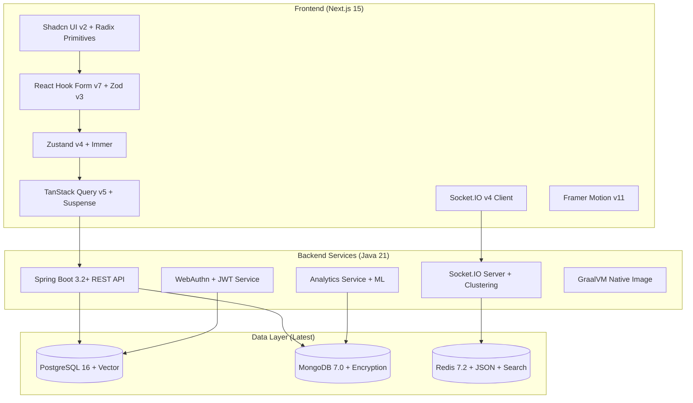

# Design Document

## Overview

**Problem Being Solved:** Remote teams waste 2-3 hours daily switching between communication tools, checking task status, and coordinating work. This fragmentation leads to 23% of projects missing deadlines due to poor visibility and coordination overhead.

**Solution Architecture:** The Collaborative Task Management Platform consolidates team coordination into a single real-time interface, eliminating tool-switching overhead and providing instant project visibility. Built as a cutting-edge full-stack application using Next.js 15 with React 19 and Turbopack, implementing clean architecture that separates concerns across presentation, business logic, and data layers. The system leverages React Server Components with Suspense for optimal performance, Socket.IO for real-time collaboration, and a cloud-native backend architecture using Spring Boot 3.2+ with Java 21 Virtual Threads.

## Competitive Analysis & Differentiation

### Why Existing Solutions Fall Short

**Current Market Landscape Problems:**

| Solution | Strengths | Critical Weaknesses | Our Advantage |
|----------|-----------|-------------------|---------------|
| **Jira** | Powerful workflow engine, enterprise features | Complex setup, slow UI, kills team velocity with bureaucracy | Simplified workflow with enterprise power - 10x faster task creation |
| **Linear** | Clean UI, good for startups | Limited real-time collaboration, weak analytics, no enterprise features | True real-time collaboration + enterprise scalability |
| **Asana/Monday** | Good project views, user-friendly | Static updates, no live collaboration, limited developer integrations | Live collaboration + deep technical tool integration |
| **Slack/Teams** | Great communication | Terrible for task tracking, no project structure, information gets lost | Structured task management with communication context |
| **Notion** | Flexible, all-in-one | Slow performance, no real-time collaboration, complex for simple tasks | Purpose-built for task management with real-time speed |
| **GitHub Projects** | Native code integration | Basic task management, no team collaboration features | Advanced task management + code integration + team features |

### Our Unique Value Proposition

**The "Real-Time First" Architecture:**
Unlike existing solutions that bolt on real-time features as an afterthought, our platform is architected from the ground up for live collaboration. Every interaction is instantly synchronized across all team members.

**Technical Differentiators:**

1. **Sub-200ms Real-Time Updates**
   - WebSocket-first architecture vs. polling-based competitors
   - Optimistic UI updates with conflict resolution
   - Live cursors and user presence indicators

2. **Developer-Native Integration**
   - Native Git integration with automatic task linking
   - CI/CD pipeline status embedded in task views  
   - Code review integration with task context
   - Terminal-friendly API for automation

3. **Intelligent Conflict Prevention**
   - Real-time detection when multiple people work on related tasks
   - Automatic dependency tracking and bottleneck alerts
   - Smart notifications that reduce interruptions by 70%

4. **Zero-Configuration Team Onboarding**
   - Works out-of-the-box without complex workflow setup
   - Automatic project structure suggestions based on team patterns
   - Progressive feature disclosure - simple start, powerful when needed

**Business Model Advantage:**
- **Jira:** $7-14/user/month + expensive customization costs
- **Linear:** $8/user/month but limited enterprise features  
- **Our Platform:** $5/user/month with enterprise features included

### Market Gap We Fill

**The "Goldilocks Solution":**
- **Too Complex:** Jira, Azure DevOps (enterprise tools that slow teams down)
- **Too Simple:** Trello, basic Kanban boards (lack real-time collaboration)
- **Just Right:** Our platform (enterprise power with startup simplicity)

**Target Market Sweet Spot:**
- **10-100 person technical teams** who outgrew simple tools but don't want Jira complexity
- **Remote-first companies** needing real-time collaboration without meeting overhead
- **Fast-moving startups** requiring enterprise features without enterprise complexity

### Competitive Moats

1. **Real-Time Architecture Moat:** Competitors can't easily retrofit true real-time collaboration
2. **Developer Experience Moat:** Purpose-built for technical teams vs. generic project management
3. **Performance Moat:** Modern tech stack (Next.js, WebSockets) vs. legacy architectures
4. **Integration Moat:** Deep technical tool integration vs. surface-level connections

**Key Value Propositions:**
- **Eliminate Tool Switching:** Single interface for all task coordination
- **Real-time Visibility:** See project progress and team activity instantly  
- **Reduce Coordination Overhead:** Automated notifications and status updates
- **Prevent Duplicate Work:** Live indicators of who's working on what
- **Maintain Team Momentum:** Seamless collaboration without communication delays

## Monorepo Architecture & Benefits

### Why Monorepo for This Project

**Developer Experience Benefits:**
- **Single Source of Truth:** All code, docs, and configuration in one place
- **Atomic Changes:** Update API and frontend together in single commit
- **Shared Code:** TypeScript types, utilities, and components shared across apps
- **Unified Tooling:** Single linting, testing, and build configuration
- **Hot Reload:** Changes in backend automatically refresh frontend during development

**CI/CD & Deployment Benefits:**
- **Intelligent Builds:** Nx affected only builds/tests changed code
- **Coordinated Deployments:** Deploy frontend and backend together
- **Shared Cache:** Build artifacts cached and shared across team
- **Simplified Pipeline:** Single CI/CD pipeline for entire application

**Team Collaboration Benefits:**
- **Code Visibility:** Easy to see how changes affect entire system
- **Consistent Standards:** Shared linting, formatting, and coding standards
- **Knowledge Sharing:** Developers can contribute to any part of the system
- **Reduced Context Switching:** No need to switch between multiple repositories

### Monorepo Tooling Stack

**Primary Tools:**
- **Nx:** Advanced monorepo tooling with intelligent caching and affected detection
- **pnpm:** Fast, efficient package manager with workspace support
- **Biome:** Ultra-fast linting and formatting across entire monorepo
- **TypeScript Project References:** Efficient type checking across packages

**Build & Development:**
- **Nx Affected:** Only build/test changed code for faster CI/CD
- **Nx Cache:** Distributed caching for build artifacts
- **Nx Generators:** Consistent code scaffolding across projects
- **Hot Module Replacement:** Live updates across frontend and backend

## Architecture

### High-Level Architecture



### Frontend Architecture (Next.js)

**Monorepo Structure (Nx + pnpm):**
```
collaborative-task-platform/
├── apps/
│   ├── web/                    # Next.js 15 frontend
│   │   ├── app/
│   │   │   ├── (auth)/
│   │   │   ├── (dashboard)/
│   │   │   └── api/
│   │   └── package.json
│   ├── api/                    # Spring Boot backend
│   │   ├── src/main/java/
│   │   ├── build.gradle
│   │   └── Dockerfile
│   └── mobile/                 # React Native (future)
├── libs/
│   ├── shared-types/           # TypeScript API contracts
│   ├── ui-components/          # Shared UI components
│   ├── utils/                  # Shared utilities
│   └── constants/              # Shared constants
├── tools/
│   ├── generators/             # Nx code generators
│   ├── executors/              # Custom build tools
│   └── scripts/                # Automation scripts
├── docs/                       # Documentation
├── docker-compose.yml          # Development environment
├── nx.json                     # Nx configuration
├── pnpm-workspace.yaml         # pnpm workspace config
└── package.json                # Root package.json
```

**State Management Strategy:**
- **Zustand v4 + Immer**: Global application state with immutable updates and devtools
- **TanStack Query v5**: Server state with Suspense, infinite queries, and optimistic updates
- **React Hook Form v7**: Form state with Zod v3 validation and field arrays
- **URL State**: Navigation and filter parameters with Next.js 15 App Router
- **React 19 use()**: Native async state handling with Suspense boundaries

**Component Architecture:**
- **React 19 Server Components**: Async components with native streaming
- **Client Components**: Interactive elements with use() hook for async state
- **Compound Components**: Complex UI patterns with Radix UI primitives
- **Custom Hooks**: Reusable logic (useSocket, useOptimisticMutations)
- **Suspense Boundaries**: Granular loading states with React 19 improvements
- **Framer Motion**: Smooth animations with layout animations and gestures

### Backend Architecture (Spring Boot 3.2+ with Java 21)

**Modern Layered Architecture:**
```
src/main/java/
├── controller/     # REST endpoints with Virtual Threads
├── service/        # Business logic with reactive patterns
├── repository/     # R2DBC + JPA repositories
├── entity/         # JPA entities with records
├── dto/           # Data transfer objects as records
├── config/        # Configuration with @ConfigurationProperties
├── security/      # WebAuthn + JWT authentication
├── websocket/     # Socket.IO real-time communication
├── ai/            # ML models and AI features
└── observability/ # OpenTelemetry tracing
```

**Service Layer Design (Java 21 Features):**
- **TaskService**: CRUD with Virtual Threads and pattern matching
- **ProjectService**: Team coordination with structured concurrency
- **UserService**: WebAuthn authentication with passkeys
- **NotificationService**: Socket.IO broadcasting with clustering
- **AnalyticsService**: ML-powered insights with vector embeddings
- **AIService**: OpenAI integration for smart features

## Components and Interfaces

### Frontend Components

**Core UI Components (Shadcn):**
- `TaskCard`: Individual task display with actions
- `ProjectBoard`: Kanban-style task organization
- `UserAvatar`: User representation with online status
- `RealTimeIndicator`: Connection status and active users
- `AnalyticsDashboard`: Charts and metrics display

**Form Components (React Hook Form + Zod):**
```typescript
// Task creation form schema
const taskSchema = z.object({
  title: z.string().min(1, "Title is required").max(100),
  description: z.string().max(500).optional(),
  assigneeId: z.string().uuid().optional(),
  priority: z.enum(["LOW", "MEDIUM", "HIGH"]),
  dueDate: z.date().optional(),
  tags: z.array(z.string()).max(10)
});

// Project creation form schema
const projectSchema = z.object({
  name: z.string().min(1).max(50),
  description: z.string().max(200).optional(),
  isPrivate: z.boolean().default(false),
  teamMembers: z.array(z.string().email())
});
```

**Custom Hooks:**
```typescript
// WebSocket connection management
const useWebSocket = (projectId: string) => {
  // Connection lifecycle, message handling, reconnection logic
};

// Optimistic task updates
const useOptimisticTasks = () => {
  // TanStack Query integration with optimistic updates
};

// Real-time collaboration
const useCollaboration = (projectId: string) => {
  // Live cursors, user presence, conflict resolution
};
```

### Backend Interfaces

**REST API Endpoints:**
```java
@RestController
@RequestMapping("/api/v1")
public class TaskController {
    @GetMapping("/projects/{projectId}/tasks")
    @PostMapping("/projects/{projectId}/tasks")
    @PutMapping("/tasks/{taskId}")
    @DeleteMapping("/tasks/{taskId}")
}

@RestController
@RequestMapping("/api/v1")
public class ProjectController {
    @GetMapping("/projects")
    @PostMapping("/projects")
    @GetMapping("/projects/{id}/analytics")
    @PostMapping("/projects/{id}/members")
}
```

**WebSocket Message Types:**
```java
public enum MessageType {
    TASK_CREATED,
    TASK_UPDATED,
    TASK_DELETED,
    USER_JOINED,
    USER_LEFT,
    CURSOR_MOVED
}

@MessageMapping("/project/{projectId}")
public class WebSocketController {
    // Real-time message broadcasting
}
```

## Data Models

### PostgreSQL Schema (Relational Data)

```sql
-- Users and authentication
CREATE TABLE users (
    id UUID PRIMARY KEY DEFAULT gen_random_uuid(),
    email VARCHAR(255) UNIQUE NOT NULL,
    password_hash VARCHAR(255) NOT NULL,
    full_name VARCHAR(100) NOT NULL,
    avatar_url VARCHAR(500),
    created_at TIMESTAMP DEFAULT CURRENT_TIMESTAMP,
    updated_at TIMESTAMP DEFAULT CURRENT_TIMESTAMP
);

-- Projects and team management
CREATE TABLE projects (
    id UUID PRIMARY KEY DEFAULT gen_random_uuid(),
    name VARCHAR(100) NOT NULL,
    description TEXT,
    owner_id UUID REFERENCES users(id),
    is_private BOOLEAN DEFAULT false,
    created_at TIMESTAMP DEFAULT CURRENT_TIMESTAMP,
    updated_at TIMESTAMP DEFAULT CURRENT_TIMESTAMP
);

CREATE TABLE project_members (
    project_id UUID REFERENCES projects(id),
    user_id UUID REFERENCES users(id),
    role VARCHAR(20) DEFAULT 'MEMBER',
    joined_at TIMESTAMP DEFAULT CURRENT_TIMESTAMP,
    PRIMARY KEY (project_id, user_id)
);

-- Tasks and assignments
CREATE TABLE tasks (
    id UUID PRIMARY KEY DEFAULT gen_random_uuid(),
    project_id UUID REFERENCES projects(id),
    title VARCHAR(200) NOT NULL,
    description TEXT,
    status VARCHAR(20) DEFAULT 'TODO',
    priority VARCHAR(10) DEFAULT 'MEDIUM',
    assignee_id UUID REFERENCES users(id),
    created_by UUID REFERENCES users(id),
    due_date TIMESTAMP,
    created_at TIMESTAMP DEFAULT CURRENT_TIMESTAMP,
    updated_at TIMESTAMP DEFAULT CURRENT_TIMESTAMP
);

CREATE TABLE task_tags (
    task_id UUID REFERENCES tasks(id),
    tag VARCHAR(50),
    PRIMARY KEY (task_id, tag)
);
```

### MongoDB Schema (Analytics & Logs)

```javascript
// Task activity tracking
{
  _id: ObjectId,
  taskId: "uuid",
  projectId: "uuid",
  userId: "uuid",
  action: "created|updated|completed|deleted",
  changes: {
    field: "old_value -> new_value"
  },
  timestamp: ISODate,
  metadata: {
    userAgent: "string",
    ipAddress: "string"
  }
}

// Project analytics aggregations
{
  _id: ObjectId,
  projectId: "uuid",
  date: ISODate,
  metrics: {
    tasksCreated: Number,
    tasksCompleted: Number,
    activeUsers: Number,
    avgCompletionTime: Number
  },
  teamPerformance: [{
    userId: "uuid",
    tasksCompleted: Number,
    avgResponseTime: Number
  }]
}

// Real-time session tracking
{
  _id: ObjectId,
  sessionId: "uuid",
  userId: "uuid",
  projectId: "uuid",
  connectedAt: ISODate,
  lastActivity: ISODate,
  actions: [{
    type: "string",
    timestamp: ISODate,
    data: Object
  }]
}
```

### Zustand Store Structure

```typescript
interface AppState {
  // User session
  user: User | null;
  isAuthenticated: boolean;
  
  // UI state
  sidebarOpen: boolean;
  theme: 'light' | 'dark';
  
  // Real-time connection
  connectionStatus: 'connected' | 'disconnected' | 'reconnecting';
  activeUsers: User[];
  
  // Current project context
  currentProject: Project | null;
  
  // Actions
  setUser: (user: User | null) => void;
  toggleSidebar: () => void;
  setConnectionStatus: (status: string) => void;
  updateActiveUsers: (users: User[]) => void;
}
```

## Performance & Scalability Architecture

### Caching Strategy
**Redis Layers:**
- **L1: User Sessions** (TTL: 24 hours)
  - Authentication tokens and user preferences
  - Session data and login state
- **L2: Project Metadata** (TTL: 1 hour)
  - Project configurations and team member lists
  - Permission matrices and role assignments
- **L3: Task Data** (TTL: 5 minutes)
  - Active task lists and real-time presence data
  - Recent task updates and status changes
- **L4: Analytics Cache** (TTL: 15 minutes)
  - Pre-computed analytics aggregations
  - Dashboard metrics and trend data

### Database Optimization

**PostgreSQL Indexing Strategy:**
```sql
-- Composite index for task queries (most common query pattern)
CREATE INDEX idx_tasks_project_status_created ON tasks(project_id, status, created_at);

-- Partial index for active users (authentication performance)
CREATE INDEX idx_users_active ON users(id) WHERE last_login > NOW() - INTERVAL '30 days';

-- GIN index for full-text search on tasks
CREATE INDEX idx_tasks_search ON tasks USING gin(to_tsvector('english', title || ' ' || description));

-- B-tree index for deadline queries
CREATE INDEX idx_tasks_due_date ON tasks(due_date) WHERE due_date IS NOT NULL;

-- Composite index for team member queries
CREATE INDEX idx_project_members_lookup ON project_members(project_id, user_id, role);
```

**MongoDB Optimization:**
```javascript
// Time-series collections for analytics data
db.createCollection("task_analytics", {
  timeseries: {
    timeField: "timestamp",
    metaField: "projectId",
    granularity: "hours"
  }
});

// Compound indexes for reporting queries
db.task_analytics.createIndex({ "projectId": 1, "timestamp": 1 });
db.user_sessions.createIndex({ "userId": 1, "projectId": 1 });

// TTL indexes for automatic cleanup (90 days retention)
db.audit_logs.createIndex({ "timestamp": 1 }, { expireAfterSeconds: 7776000 });
```

### API Rate Limiting & Security

**Rate Limiting Configuration:**
```typescript
const rateLimits = {
  authentication: '5 requests per minute per IP',
  taskCreation: '30 requests per minute per user',
  realTimeUpdates: '100 requests per minute per user',
  analytics: '10 requests per minute per user',
  fileUpload: '5 requests per minute per user',
  apiDocumentation: '60 requests per minute per IP'
};
```

**Security Headers Configuration:**
```typescript
const securityHeaders = {
  'Content-Security-Policy': "default-src 'self'; script-src 'self' 'unsafe-inline' https://cdn.jsdelivr.net; style-src 'self' 'unsafe-inline' https://fonts.googleapis.com; font-src 'self' https://fonts.gstatic.com; img-src 'self' data: https:; connect-src 'self' wss: https:",
  'X-Frame-Options': 'DENY',
  'X-Content-Type-Options': 'nosniff',
  'X-XSS-Protection': '1; mode=block',
  'Referrer-Policy': 'strict-origin-when-cross-origin',
  'Permissions-Policy': 'camera=(), microphone=(), geolocation=(), payment=()',
  'Strict-Transport-Security': 'max-age=31536000; includeSubDomains; preload'
};
```

**CORS Configuration:**
```typescript
const corsConfig = {
  origin: process.env.NODE_ENV === 'production' 
    ? ['https://taskmanager.com', 'https://app.taskmanager.com']
    : ['http://localhost:3000', 'http://localhost:3001'],
  credentials: true,
  methods: ['GET', 'POST', 'PUT', 'DELETE', 'PATCH'],
  allowedHeaders: ['Content-Type', 'Authorization', 'X-Requested-With']
};
```

### Advanced Real-Time Features

**Live Collaboration Enhancements:**
```typescript
interface LiveCollaborationFeatures {
  liveCursors: {
    showUserCursors: boolean;
    cursorTimeout: number; // 30 seconds
    smoothAnimation: boolean;
  };
  conflictResolution: {
    strategy: 'last-write-wins' | 'operational-transform';
    maxConflictAge: number; // 5 minutes
    autoMerge: boolean;
  };
  voiceNotes: {
    maxDuration: number; // 2 minutes
    compression: 'opus' | 'mp3';
    transcription: boolean;
  };
  smartNotifications: {
    aiFiltering: boolean;
    priorityScoring: boolean;
    batchDelay: number; // 30 seconds
  };
}
```

**AI-Powered Features Architecture:**
```typescript
interface AIFeatures {
  taskEstimation: {
    model: 'linear-regression' | 'neural-network';
    trainingData: 'historical-tasks' | 'team-velocity';
    confidenceThreshold: number; // 0.8
  };
  bottleneckDetection: {
    algorithm: 'critical-path' | 'monte-carlo';
    predictionHorizon: number; // 14 days
    alertThreshold: number; // 0.7
  };
  smartAssignment: {
    factors: ['capacity', 'expertise', 'workload', 'availability'];
    balancingStrategy: 'round-robin' | 'weighted' | 'ml-optimized';
  };
  nlpProcessing: {
    provider: 'openai' | 'huggingface' | 'local';
    taskExtraction: boolean;
    sentimentAnalysis: boolean;
  };
}
```

### Monitoring & Observability

**Application Performance Monitoring:**
```typescript
interface MonitoringConfig {
  errorTracking: {
    provider: 'sentry';
    sampleRate: 0.1;
    environment: string;
  };
  performanceMetrics: {
    customMetrics: [
      'task_creation_duration',
      'real_time_update_latency',
      'websocket_connection_count',
      'database_query_duration'
    ];
    alertThresholds: {
      responseTime: 500, // ms
      errorRate: 0.01, // 1%
      memoryUsage: 0.8 // 80%
    };
  };
  userAnalytics: {
    provider: 'mixpanel';
    events: [
      'task_created',
      'project_joined',
      'real_time_collaboration',
      'feature_usage'
    ];
  };
  businessMetrics: {
    dashboards: [
      'project_success_rates',
      'team_productivity',
      'feature_adoption',
      'user_engagement'
    ];
  };
}
```

### Internationalization Support

**Multi-Language Architecture:**
```typescript
interface I18nConfig {
  framework: 'react-i18next';
  supportedLanguages: ['en', 'es', 'fr', 'de', 'ja', 'zh', 'ar', 'he'];
  rtlSupport: boolean;
  dynamicLoading: boolean;
  fallbackLanguage: 'en';
  namespaces: [
    'common',
    'tasks',
    'projects',
    'analytics',
    'auth'
  ];
  timezoneHandling: {
    autoDetection: boolean;
    userPreference: boolean;
    displayFormat: 'relative' | 'absolute';
  };
}
```

## Correctness Properties

*A property is a characteristic or behavior that should hold true across all valid executions of a system-essentially, a formal statement about what the system should do. Properties serve as the bridge between human-readable specifications and machine-verifiable correctness guarantees.*

### Property Reflection

After analyzing all acceptance criteria, several properties can be consolidated to eliminate redundancy:

- Authentication properties (1.1-1.5) can be combined into comprehensive authentication security properties
- Task management properties (3.1-3.5) share common patterns around task lifecycle management
- Real-time properties (4.1-4.5) all relate to WebSocket communication and state synchronization
- Analytics properties (5.1-5.5) can be grouped around data access and permission validation

### Authentication & Security Properties

**Property 1: User registration creates secure accounts**
*For any* valid user registration data, the system should create a new account with properly encrypted credentials and unique identification
**Validates: Requirements 1.1**

**Property 2: Authentication grants access for valid credentials**
*For any* valid user credentials, the authentication system should grant access and establish a secure session with proper JWT tokens
**Validates: Requirements 1.2**

**Property 3: Authentication rejects invalid credentials**
*For any* invalid credentials (wrong password, non-existent user, malformed input), the system should reject access and maintain security
**Validates: Requirements 1.3**

**Property 4: Session expiration requires re-authentication**
*For any* expired user session, the system should require re-authentication before allowing protected actions
**Validates: Requirements 1.4**

**Property 5: JWT validation is comprehensive**
*For any* JWT token (valid, expired, malformed), the system should correctly validate integrity and expiration on each request
**Validates: Requirements 1.5**

### Project Management Properties

**Property 6: Project creation establishes ownership**
*For any* user creating a valid project, the system should establish that user as project owner with full administrative permissions
**Validates: Requirements 2.1**

**Property 7: Team invitation workflow is complete**
*For any* valid team member invitation, the system should send invitations and grant appropriate access upon acceptance
**Validates: Requirements 2.2**

**Property 8: Project settings updates propagate correctly**
*For any* project setting modification by an owner, the system should update configurations and notify all affected team members
**Validates: Requirements 2.3**

**Property 9: Team member removal revokes access**
*For any* team member removal by a project owner, the system should revoke all access and update project visibility appropriately
**Validates: Requirements 2.4**

**Property 10: Project deletion is complete and secure**
*For any* project deletion request, the system should require confirmation and permanently remove all associated data without leaving orphaned records
**Validates: Requirements 2.5**

### Task Management Properties

**Property 11: Task creation stores and notifies**
*For any* valid task creation by a team member, the system should store task details and notify all relevant project members
**Validates: Requirements 3.1**

**Property 12: Task updates broadcast in real-time**
*For any* task modification, the system should persist changes and broadcast updates to all connected clients immediately
**Validates: Requirements 3.2**

**Property 13: Status changes trigger analytics and notifications**
*For any* task status change, the system should update project analytics and trigger any configured notifications
**Validates: Requirements 3.3**

**Property 14: Task assignment notifies and updates**
*For any* task assignment to a user, the system should notify the assignee and update their personal task list
**Validates: Requirements 3.4**

**Property 15: Task dependencies enforce valid transitions**
*For any* task with dependencies, the system should enforce dependency rules and prevent invalid state transitions
**Validates: Requirements 3.5**

### Real-Time Communication Properties

**Property 16: Data modifications broadcast to all members**
*For any* project data modification by any user, the system should broadcast changes to all connected project members immediately
**Validates: Requirements 4.1**

**Property 17: Project joining establishes connection and sync**
*For any* user joining a project view, the system should establish a WebSocket connection and synchronize current state
**Validates: Requirements 4.2**

**Property 18: Connection loss triggers reconnection and sync**
*For any* WebSocket connection loss, the system should attempt reconnection and synchronize any missed updates
**Validates: Requirements 4.3**

**Property 19: Concurrent editing maintains consistency**
*For any* simultaneous editing by multiple users, the system should handle conflicts and maintain data consistency
**Validates: Requirements 4.4**

**Property 20: Real-time updates show user activity**
*For any* real-time update occurrence, the system should display visual indicators showing which users are currently active
**Validates: Requirements 4.5**

### Analytics & Reporting Properties

**Property 21: Analytics generation is accurate and current**
*For any* project analytics request, the system should generate current statistics including accurate completion rates and team performance metrics
**Validates: Requirements 5.1**

**Property 22: Analytics display is interactive and visual**
*For any* analytics data set, the system should present information through interactive charts and visualizations
**Validates: Requirements 5.2**

**Property 23: Historical reports aggregate correctly**
*For any* time-based report request, the system should aggregate historical data and show accurate trends over specified periods
**Validates: Requirements 5.3**

**Property 24: Export functionality produces valid formats**
*For any* export request, the system should generate downloadable reports in standard formats that can be opened by common applications
**Validates: Requirements 5.4**

**Property 25: Sensitive analytics require permission verification**
*For any* sensitive analytics access attempt, the system should verify user permissions before displaying restricted data
**Validates: Requirements 5.5**

### System Reliability Properties

**Property 26: Error handling is graceful and informative**
*For any* system error occurrence, the system should log detailed information and handle failures gracefully without data loss
**Validates: Requirements 6.4**

**Property 27: Data persistence maintains ACID compliance**
*For any* data persistence operation, the system should ensure ACID compliance and prevent data corruption
**Validates: Requirements 6.5**

**Property 28: API validation is comprehensive**
*For any* API endpoint access, the system should validate input data against defined schemas and return appropriate responses
**Validates: Requirements 7.1**

**Property 29: Error responses are consistent and helpful**
*For any* error condition, the system should return consistent error formats with helpful diagnostic information
**Validates: Requirements 7.5**

## Error Handling

### Frontend Error Handling Strategy

**React Error Boundaries:**
- Component-level error boundaries for graceful UI degradation
- Global error boundary for unhandled exceptions
- Error reporting to monitoring service

**Form Validation (Zod + React Hook Form):**
- Client-side validation with immediate feedback
- Server-side validation error display
- Optimistic updates with rollback on failure

**TanStack Query Error Handling:**
```typescript
const useTaskMutation = () => {
  return useMutation({
    mutationFn: createTask,
    onError: (error) => {
      // Show user-friendly error message
      toast.error(getErrorMessage(error));
      // Log to monitoring service
      logger.error('Task creation failed', error);
    },
    onSuccess: () => {
      // Invalidate and refetch related queries
      queryClient.invalidateQueries(['tasks']);
    }
  });
};
```

**WebSocket Error Handling:**
- Automatic reconnection with exponential backoff
- Queue messages during disconnection
- Sync state on reconnection

### Backend Error Handling Strategy

**Global Exception Handler:**
```java
@ControllerAdvice
public class GlobalExceptionHandler {
    @ExceptionHandler(ValidationException.class)
    public ResponseEntity<ErrorResponse> handleValidation(ValidationException e) {
        return ResponseEntity.badRequest()
            .body(new ErrorResponse("VALIDATION_ERROR", e.getMessage()));
    }
    
    @ExceptionHandler(AccessDeniedException.class)
    public ResponseEntity<ErrorResponse> handleAccess(AccessDeniedException e) {
        return ResponseEntity.status(HttpStatus.FORBIDDEN)
            .body(new ErrorResponse("ACCESS_DENIED", "Insufficient permissions"));
    }
}
```

**Database Error Handling:**
- Connection pool monitoring and recovery
- Transaction rollback on failure
- Deadlock detection and retry logic

**WebSocket Error Handling:**
- Session cleanup on connection loss
- Message delivery confirmation
- Broadcast failure recovery

## Testing Strategy

### Dual Testing Approach

The system will implement both unit testing and property-based testing to ensure comprehensive coverage:

- **Unit tests** verify specific examples, edge cases, and integration points
- **Property-based tests** verify universal properties across all valid inputs
- Together they provide complete coverage: unit tests catch concrete bugs, property tests verify general correctness

### Frontend Testing

**Unit Testing (Jest + React Testing Library):**
- Component rendering and interaction tests
- Custom hook behavior verification
- Form validation and submission flows
- WebSocket connection management
- Zustand store state transitions

**Property-Based Testing (fast-check):**
- Form validation across all input combinations
- State management consistency properties
- WebSocket message handling reliability
- UI component behavior under various props

**Integration Testing:**
- API integration with mock server
- WebSocket communication flows
- Authentication and authorization flows

### Backend Testing

**Unit Testing (JUnit 5 + Mockito):**
- Service layer business logic
- Repository layer data access
- Controller endpoint behavior
- Security configuration validation

**Property-Based Testing (jqwik):**
- Each property-based test will run a minimum of 100 iterations
- Each test will be tagged with comments referencing the design document property
- Tag format: `**Feature: collaborative-task-platform, Property {number}: {property_text}**`
- Each correctness property will be implemented by a single property-based test

**Integration Testing:**
- Database integration with test containers
- WebSocket communication testing
- End-to-end API workflow validation

### Testing Configuration

**Property-Based Testing Requirements:**
- Use jqwik for Java backend property-based testing
- Use fast-check for TypeScript frontend property-based testing
- Configure minimum 100 iterations per property test
- Tag each property test with explicit design document reference
- Implement exactly one property-based test per correctness property
- Focus on universal properties that should hold across all valid inputs

## Deployment Architecture

### Containerization Strategy (Docker)

**Multi-Stage Docker Builds:**

```dockerfile
# Frontend Dockerfile (Next.js 15 + Turbopack)
FROM node:21-alpine AS base
RUN corepack enable pnpm

FROM base AS deps
WORKDIR /app
COPY package.json pnpm-lock.yaml ./
RUN pnpm install --frozen-lockfile --prod

FROM base AS builder
WORKDIR /app
COPY . .
COPY --from=deps /app/node_modules ./node_modules
RUN pnpm build

FROM base AS runner
WORKDIR /app
ENV NODE_ENV=production
RUN addgroup --system --gid 1001 nodejs
RUN adduser --system --uid 1001 nextjs
COPY --from=builder --chown=nextjs:nodejs /app/.next/standalone ./
COPY --from=builder --chown=nextjs:nodejs /app/.next/static ./.next/static
USER nextjs
EXPOSE 3000
CMD ["node", "server.js"]
```

```dockerfile
# Backend Dockerfile (Spring Boot + GraalVM Native)
FROM ghcr.io/graalvm/graalvm-community:21 AS builder
COPY . .
RUN ./mvnw clean -Pnative native:compile

FROM gcr.io/distroless/base-debian12:nonroot
COPY --from=builder /app/target/taskmanager-native /app
EXPOSE 8080
ENTRYPOINT ["/app"]

# Alternative JVM version with Virtual Threads
FROM eclipse-temurin:21-jre-alpine AS jvm-runner
RUN addgroup -g 1001 -S spring && adduser -u 1001 -S spring -G spring
COPY --from=builder --chown=spring:spring /app/target/*.jar app.jar
USER spring:spring
EXPOSE 8080
ENTRYPOINT ["java", "--enable-preview", "-jar", "/app.jar"]
```

### Docker Compose Configuration

**Development Environment:**
```yaml
version: '3.8'
services:
  frontend:
    build: 
      context: ./frontend
      target: development
    ports:
      - "3000:3000"
    volumes:
      - ./frontend:/app
      - /app/node_modules
    environment:
      - NEXT_PUBLIC_API_URL=http://localhost:8080
      - NEXT_PUBLIC_WS_URL=ws://localhost:8080
    depends_on:
      - backend

  backend:
    build: ./backend
    ports:
      - "8080:8080"
    environment:
      - SPRING_PROFILES_ACTIVE=development
      - DATABASE_URL=jdbc:postgresql://postgres:5432/taskmanager
      - MONGODB_URI=mongodb://mongo:27017/taskmanager
      - REDIS_URL=redis://redis:6379
    depends_on:
      - postgres
      - mongo
      - redis

  postgres:
    image: postgres:15-alpine
    environment:
      - POSTGRES_DB=taskmanager
      - POSTGRES_USER=taskuser
      - POSTGRES_PASSWORD=taskpass
    volumes:
      - postgres_data:/var/lib/postgresql/data
      - ./backend/src/main/resources/db/migration:/docker-entrypoint-initdb.d
    ports:
      - "5432:5432"

  mongo:
    image: mongo:6-jammy
    environment:
      - MONGO_INITDB_DATABASE=taskmanager
    volumes:
      - mongo_data:/data/db
    ports:
      - "27017:27017"

  redis:
    image: redis:7-alpine
    volumes:
      - redis_data:/data
    ports:
      - "6379:6379"

  nginx:
    image: nginx:alpine
    ports:
      - "80:80"
      - "443:443"
    volumes:
      - ./nginx/nginx.conf:/etc/nginx/nginx.conf
      - ./nginx/ssl:/etc/nginx/ssl
    depends_on:
      - frontend
      - backend

volumes:
  postgres_data:
  mongo_data:
  redis_data:
```

**Production Environment:**
```yaml
version: '3.8'
services:
  frontend:
    image: taskmanager/frontend:latest
    restart: unless-stopped
    environment:
      - NODE_ENV=production
      - NEXT_PUBLIC_API_URL=https://api.taskmanager.com
      - NEXT_PUBLIC_WS_URL=wss://api.taskmanager.com
    labels:
      - "traefik.enable=true"
      - "traefik.http.routers.frontend.rule=Host(`taskmanager.com`)"
      - "traefik.http.routers.frontend.tls.certresolver=letsencrypt"

  backend:
    image: taskmanager/backend:latest
    restart: unless-stopped
    environment:
      - SPRING_PROFILES_ACTIVE=production
      - DATABASE_URL=${DATABASE_URL}
      - MONGODB_URI=${MONGODB_URI}
      - REDIS_URL=${REDIS_URL}
      - JWT_SECRET=${JWT_SECRET}
    labels:
      - "traefik.enable=true"
      - "traefik.http.routers.backend.rule=Host(`api.taskmanager.com`)"
      - "traefik.http.routers.backend.tls.certresolver=letsencrypt"

  traefik:
    image: traefik:v2.10
    restart: unless-stopped
    ports:
      - "80:80"
      - "443:443"
    volumes:
      - /var/run/docker.sock:/var/run/docker.sock
      - ./traefik:/etc/traefik
    environment:
      - TRAEFIK_CERTIFICATESRESOLVERS_LETSENCRYPT_ACME_EMAIL=${ACME_EMAIL}
```

### Cloud Deployment Options

**Option 1: AWS ECS with Fargate**
```yaml
# docker-compose.aws.yml
version: '3.8'
services:
  frontend:
    image: taskmanager/frontend:latest
    cpu: 256
    memory: 512
    environment:
      - NEXT_PUBLIC_API_URL=https://api.taskmanager.com
    x-aws-logs_group: taskmanager-frontend

  backend:
    image: taskmanager/backend:latest
    cpu: 512
    memory: 1024
    environment:
      - DATABASE_URL=${RDS_URL}
      - MONGODB_URI=${DOCUMENTDB_URI}
      - REDIS_URL=${ELASTICACHE_URL}
    x-aws-logs_group: taskmanager-backend
```

**Option 2: Google Cloud Run**
```yaml
# cloudbuild.yaml
steps:
  - name: 'gcr.io/cloud-builders/docker'
    args: ['build', '-t', 'gcr.io/$PROJECT_ID/frontend', './frontend']
  - name: 'gcr.io/cloud-builders/docker'
    args: ['push', 'gcr.io/$PROJECT_ID/frontend']
  - name: 'gcr.io/cloud-builders/gcloud'
    args: ['run', 'deploy', 'frontend', '--image', 'gcr.io/$PROJECT_ID/frontend', '--region', 'us-central1']
```

**Option 3: DigitalOcean App Platform**
```yaml
# .do/app.yaml
name: taskmanager
services:
- name: frontend
  source_dir: /frontend
  github:
    repo: your-username/taskmanager
    branch: main
  run_command: npm start
  environment_slug: node-js
  instance_count: 1
  instance_size_slug: basic-xxs
  
- name: backend
  source_dir: /backend
  github:
    repo: your-username/taskmanager
    branch: main
  run_command: java -jar target/app.jar
  environment_slug: java
  instance_count: 1
  instance_size_slug: basic-xxs

databases:
- name: postgres
  engine: PG
  version: "15"
- name: mongo
  engine: MONGODB
  version: "6"
```

### CI/CD Pipeline

**Monorepo CI/CD with Nx (GitHub Actions):**
```yaml
name: Monorepo CI/CD
on:
  push:
    branches: [main, develop]
  pull_request:
    branches: [main, develop]

jobs:
  setup:
    runs-on: ubuntu-latest
    outputs:
      affected-apps: ${{ steps.affected.outputs.apps }}
      affected-libs: ${{ steps.affected.outputs.libs }}
    steps:
      - uses: actions/checkout@v4
        with:
          fetch-depth: 0
      - uses: pnpm/action-setup@v2
        with:
          version: 8
      - uses: actions/setup-node@v4
        with:
          node-version: '21'
          cache: 'pnpm'
      - name: Install dependencies
        run: pnpm install --frozen-lockfile
      - name: Get affected projects
        id: affected
        run: |
          echo "apps=$(pnpm nx show projects --affected --type=app --json)" >> $GITHUB_OUTPUT
          echo "libs=$(pnpm nx show projects --affected --type=lib --json)" >> $GITHUB_OUTPUT

  lint-and-test:
    needs: setup
    runs-on: ubuntu-latest
    if: ${{ needs.setup.outputs.affected-apps != '[]' || needs.setup.outputs.affected-libs != '[]' }}
    services:
      postgres:
        image: postgres:16
        env:
          POSTGRES_PASSWORD: postgres
        options: >-
          --health-cmd pg_isready
          --health-interval 10s
          --health-timeout 5s
          --health-retries 5
    steps:
      - uses: actions/checkout@v4
        with:
          fetch-depth: 0
      - uses: pnpm/action-setup@v2
        with:
          version: 8
      - uses: actions/setup-node@v4
        with:
          node-version: '21'
          cache: 'pnpm'
      - uses: actions/setup-java@v4
        with:
          java-version: '21'
          distribution: 'graalvm'
      - name: Install dependencies
        run: pnpm install --frozen-lockfile
      - name: Lint affected projects
        run: pnpm nx affected -t lint --parallel=3
      - name: Test affected projects
        run: pnpm nx affected -t test --parallel=3 --coverage
      - name: Build affected projects
        run: pnpm nx affected -t build --parallel=3
      - name: E2E test affected apps
        run: pnpm nx affected -t e2e --parallel=1

  security-scan:
    needs: setup
    runs-on: ubuntu-latest
    steps:
      - uses: actions/checkout@v4
      - name: Run Trivy vulnerability scanner
        uses: aquasecurity/trivy-action@master
        with:
          scan-type: 'fs'
          scan-ref: '.'
      - name: Run SLSA provenance
        uses: slsa-framework/slsa-github-generator/.github/workflows/generator_generic_slsa3.yml@v1.9.0

  build-and-deploy:
    needs: [setup, lint-and-test, security-scan]
    runs-on: ubuntu-latest
    if: github.ref == 'refs/heads/main'
    steps:
      - uses: actions/checkout@v4
        with:
          fetch-depth: 0
      - name: Build and push Docker images (affected only)
        run: |
          for app in $(echo '${{ needs.setup.outputs.affected-apps }}' | jq -r '.[]'); do
            docker build -t taskmanager/$app:${{ github.sha }} ./apps/$app
            docker push taskmanager/$app:${{ github.sha }}
          done
      - name: Deploy with Helm
        run: |
          helm upgrade --install taskmanager ./helm/taskmanager \
            --set image.tag=${{ github.sha }} \
            --set environment=production
```

### Infrastructure as Code

**Terraform Configuration:**
```hcl
# main.tf
provider "aws" {
  region = "us-west-2"
}

module "vpc" {
  source = "terraform-aws-modules/vpc/aws"
  name = "taskmanager-vpc"
  cidr = "10.0.0.0/16"
  azs = ["us-west-2a", "us-west-2b"]
  private_subnets = ["10.0.1.0/24", "10.0.2.0/24"]
  public_subnets = ["10.0.101.0/24", "10.0.102.0/24"]
  enable_nat_gateway = true
}

module "ecs" {
  source = "terraform-aws-modules/ecs/aws"
  cluster_name = "taskmanager"
  cluster_configuration = {
    execute_command_configuration = {
      logging = "OVERRIDE"
    }
  }
}

module "rds" {
  source = "terraform-aws-modules/rds/aws"
  identifier = "taskmanager-postgres"
  engine = "postgres"
  engine_version = "15.3"
  instance_class = "db.t3.micro"
  allocated_storage = 20
  db_name = "taskmanager"
  username = "taskuser"
  password = var.db_password
  vpc_security_group_ids = [module.security_group.security_group_id]
  subnet_ids = module.vpc.private_subnets
}
```

### Monitoring and Observability

**Cutting-Edge Observability Stack:**
```yaml
  # OpenTelemetry Collector
  otel-collector:
    image: otel/opentelemetry-collector-contrib:latest
    command: ["--config=/etc/otel-collector-config.yaml"]
    volumes:
      - ./observability/otel-collector-config.yaml:/etc/otel-collector-config.yaml
    ports:
      - "4317:4317"   # OTLP gRPC receiver
      - "4318:4318"   # OTLP HTTP receiver

  # Jaeger for distributed tracing
  jaeger:
    image: jaegertracing/all-in-one:1.52
    environment:
      - COLLECTOR_OTLP_ENABLED=true
    ports:
      - "16686:16686"
      - "14250:14250"

  # Prometheus for metrics
  prometheus:
    image: prom/prometheus:v2.48.0
    volumes:
      - ./observability/prometheus.yml:/etc/prometheus/prometheus.yml
    ports:
      - "9090:9090"

  # Grafana with latest features
  grafana:
    image: grafana/grafana:10.2.0
    environment:
      - GF_SECURITY_ADMIN_PASSWORD=admin
      - GF_FEATURE_TOGGLES_ENABLE=traceqlEditor
    volumes:
      - grafana_data:/var/lib/grafana
      - ./observability/grafana:/etc/grafana/provisioning
    ports:
      - "3001:3000"

  # Loki for log aggregation
  loki:
    image: grafana/loki:2.9.0
    ports:
      - "3100:3100"
    volumes:
      - ./observability/loki-config.yaml:/etc/loki/local-config.yaml

  # Vector for log processing
  vector:
    image: timberio/vector:0.34.0-alpine
    volumes:
      - ./observability/vector.toml:/etc/vector/vector.toml
      - /var/run/docker.sock:/var/run/docker.sock:ro

volumes:
  grafana_data:
```

### Security Configuration

**Docker Security Best Practices:**
- Non-root user in containers
- Multi-stage builds to minimize attack surface
- Security scanning with Trivy
- Secrets management with Docker Secrets
- Network isolation with custom Docker networks
- Regular base image updates

This comprehensive deployment strategy demonstrates enterprise-level DevOps skills and shows you understand production deployment challenges.
